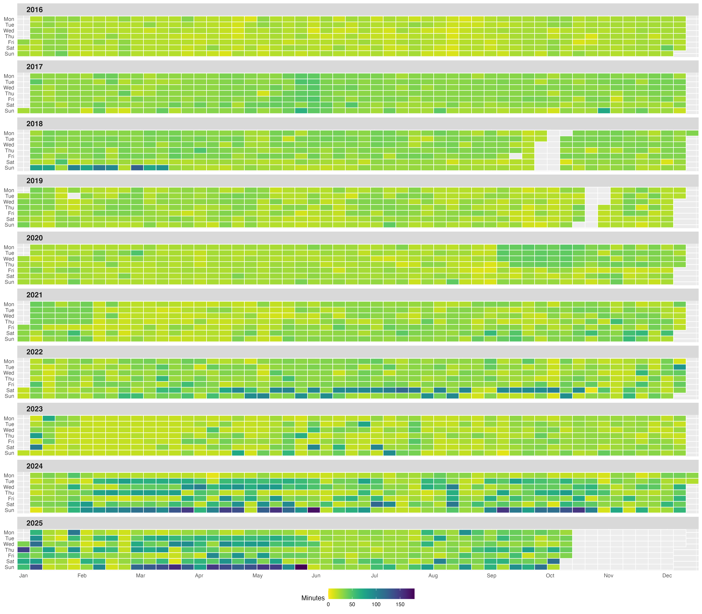
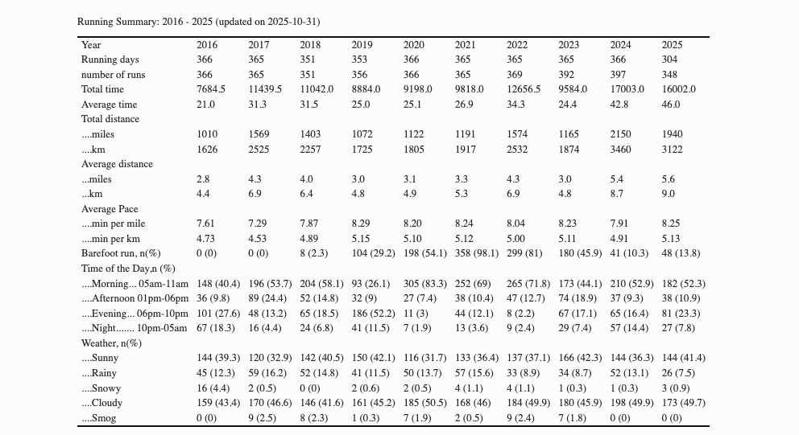

On 01-01-2016, I decided to run at least one mile a day every day for the rest of my life. 

And I keep a record here, as a method to keep myself motivated. I also write short posts weekly in Chinese to reflect on my running. [->Link to all my current posts<-](https://conge.github.io/category/#%E6%8A%98%E8%BF%94%E7%82%B9) and [my daily running page](https://conge.github.io/running_page/).

See my running records below:

[2016](https://github.com/conge/RunningStreak/blob/master/runningRecords2016.csv), [2017](https://github.com/conge/RunningStreak/blob/master/runningRecords2017.csv), [2018](https://github.com/conge/RunningStreak/blob/master/runningRecords2018.csv), [2018 Reload](https://github.com/conge/RunningStreak/blob/master/runningRecords2018_reload.csv), [2019](https://github.com/conge/RunningStreak/blob/master/runningRecords2019.csv), [2019_reload](https://github.com/conge/RunningStreak/blob/master/runningRecords2019_reload.csv),  [2020](https://github.com/conge/RunningStreak/blob/master/runningRecords2020.csv), [2021](https://github.com/conge/RunningStreak/blob/master/runningRecords2021.csv), [2022](https://github.com/conge/RunningStreak/blob/master/runningRecords2022.csv), [2023](https://github.com/conge/RunningStreak/blob/master/runningRecords2023.csv),  [2024]((https://github.com/conge/RunningStreak/blob/master/runningRecords2024.csv)), and [2025]((https://github.com/conge/RunningStreak/blob/master/runningRecords2025.csv)).

My inspiration came from the [United States Running Streak Association, Inc.][1], although I am not a member but the Association are full of people who keep running as part of their daily routine.

### Visuals of my running history: 2016 - now

### Summary of my running history:

[1]:http://www.runeveryday.com
